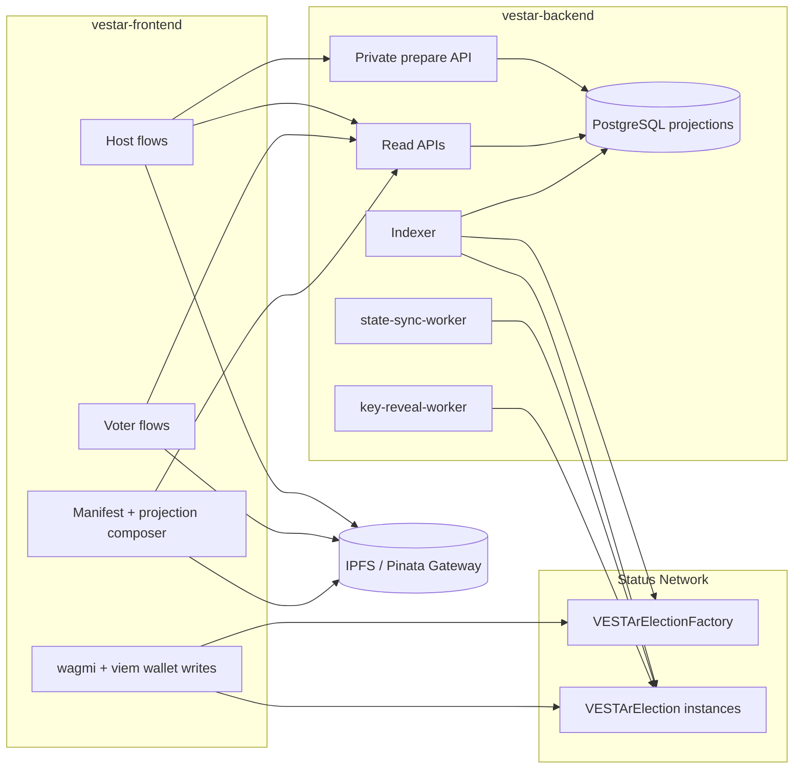
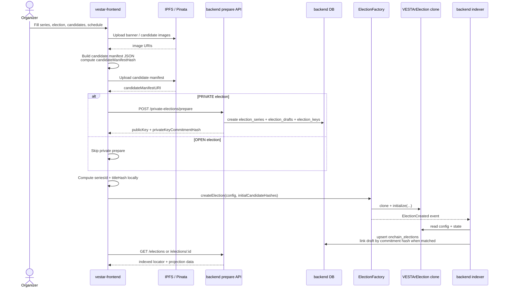
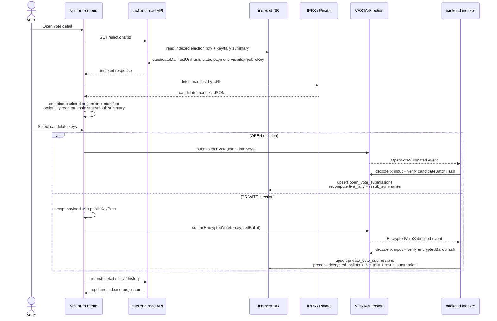
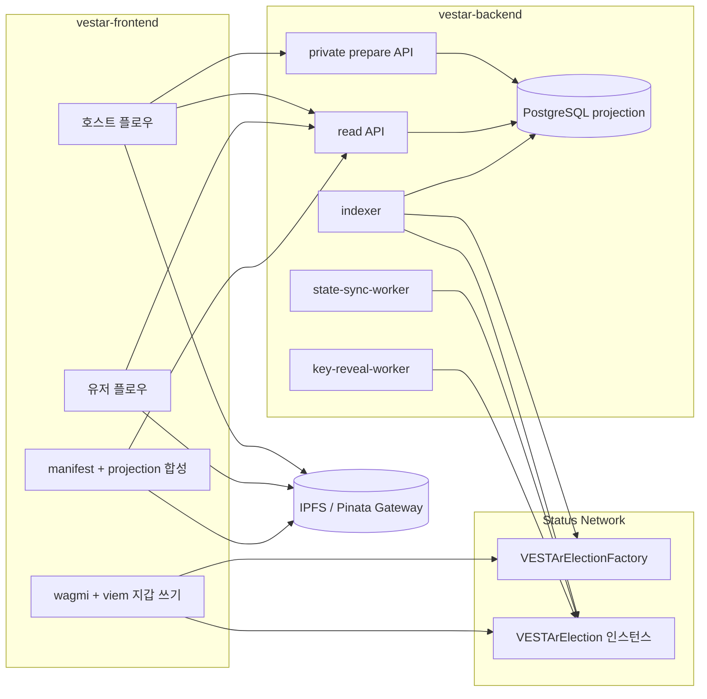
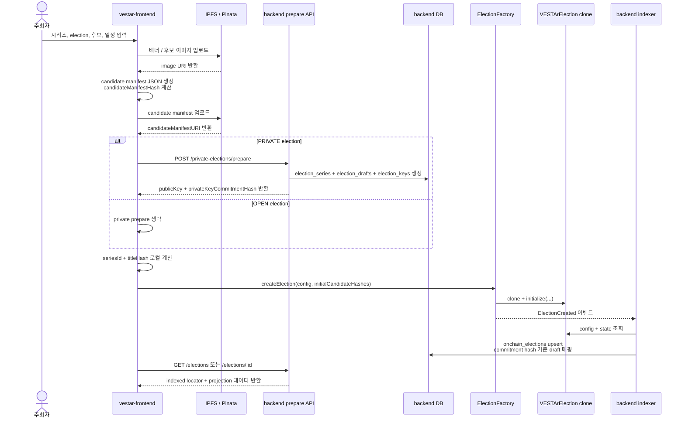
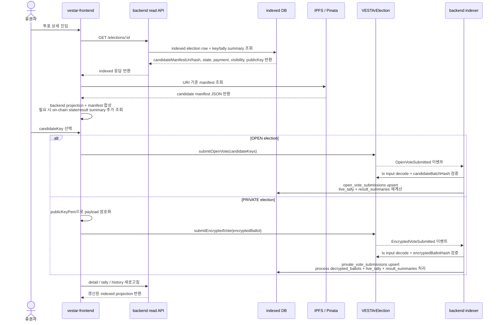

# VESTAr Frontend

Frontend for VESTAr election creation, vote submission, and indexed read composition.

## English

### Overview

This app owns the browser-side write path and the presentation-side read path.

- Organizers upload candidate manifests and images to IPFS/Pinata.
- Organizers and voters sign write transactions from their own wallets.
- The backend is used for `PRIVATE` election preparation and indexed read APIs.
- The UI renders final screens by combining backend locator/projection data with IPFS manifest data.
- A sibling verification portal can be embedded into the production build under `/vote/verification`.

### Current Stack

| Layer | Current choice |
| --- | --- |
| App | React 19 + TypeScript |
| Build | Vite 8 |
| Styling | Tailwind CSS 4 |
| Routing | React Router 7 |
| Data | TanStack Query + custom fetch helpers |
| Web3 | wagmi + viem |
| Tests | Vitest + Testing Library |
| Lint / format | Biome 2 |

### Read/Write Split

| Concern | Primary source | Frontend role |
| --- | --- | --- |
| Election creation tx | `VESTArElectionFactory` | Build config and ask wallet to sign |
| Ballot submission tx | `VESTArElection` | Build plaintext or encrypted payload and ask wallet to sign |
| Private election key material | `POST /private-elections/prepare` | Receive public key and commitment for `PRIVATE` elections |
| Election list / detail / tally / history | Backend indexer DB | Consume `/elections`, `/live-tally`, `/finalized-tally`, `/result-summaries`, `/vote-submissions/history` |
| Render metadata | IPFS manifest | Render titles, series names, cover images, candidate images |
| Final authority | On-chain contracts | Override or confirm selected state and counters when needed |

### Architecture



### Sequence: Election Creation



Implementation notes:

- `candidateManifestHash` comes from the frontend-generated JSON bytes, not from the backend.
- `/private-elections/prepare` is only used for `PRIVATE` elections.
- The current create flow computes `seriesId` and `titleHash` in the frontend before calling `createElection`.
- Manifest upload falls back to a `data:` URI when IPFS upload fails. Image upload failure degrades to image-less metadata instead of blocking creation.

### Sequence: Vote Detail Load And Ballot Submission



Implementation notes:

- The backend does not relay ballot transactions. Wallet writes go straight from browser to contract.
- `PRIVATE` ballots are encrypted in the browser with the public key returned by the backend prepare flow.
- After confirmation, the backend indexer becomes the main read source again by projecting the new submission into API-friendly tables.

### Repository Map

```text
vestar-frontend/
├─ src/
│  ├─ api/                         # backend read / prepare clients
│  ├─ contracts/vestar/            # viem actions, chain config, generated ABIs
│  ├─ hooks/host/                  # election creation / host dashboards
│  ├─ hooks/user/                  # vote detail / submit / result hooks
│  ├─ pages/host/                  # multi-step create and host pages
│  ├─ pages/vote/                  # list / detail / live tally / result pages
│  ├─ features/verification/       # verification portal UI helpers
│  └─ utils/                       # IPFS, manifest, optimistic cache, crypto helpers
├─ scripts/
│  ├─ build-with-verification-portal.mjs
│  └─ sync-vestar-contracts.mjs
└─ README.md
```

### Environment

| Variable | Purpose |
| --- | --- |
| `VITE_API_BASE_URL` | Backend base URL for `/elections`, `/private-elections/prepare`, tally, and history APIs |
| `VITE_PINATA_JWT` or `PINATA_JWT` | Pinata upload token used by browser-side IPFS uploads |
| `VITE_PINATA_GATEWAY_URL` or `PINATA_GATEWAYS` | Gateway base URL list used to resolve `ipfs://` assets |

### Scripts

| Command | Purpose |
| --- | --- |
| `pnpm dev` | Run the Vite dev server |
| `pnpm build` | Build the app and embed the verification portal when the sibling repo exists |
| `pnpm build:app` | Build only the frontend app |
| `pnpm preview` | Preview the production build |
| `pnpm sync:vestar-contracts` | Sync ABI and address artifacts from `../contracts/abi` |
| `pnpm check` | Run Biome checks |
| `pnpm check:fix` | Apply Biome fixes |
| `pnpm test` | Run unit tests |
| `pnpm test:coverage` | Run tests with coverage |

## 한국어

### 개요

이 앱은 브라우저 기준 쓰기 경로와 화면 렌더링용 읽기 경로를 담당한다.

- 주최자는 후보 manifest와 이미지를 IPFS/Pinata에 업로드한다.
- 주최자와 유권자는 각자 지갑으로 write 트랜잭션을 서명한다.
- 백엔드는 `PRIVATE` election 준비와 indexed read API를 담당한다.
- UI는 백엔드 locator/projection 데이터와 IPFS manifest 데이터를 합성해 최종 화면을 만든다.
- 형제 저장소가 존재하면 verification portal을 `/vote/verification` 경로로 함께 빌드한다.

### 현재 스택

| 계층 | 현재 선택 |
| --- | --- |
| 앱 | React 19 + TypeScript |
| 빌드 | Vite 8 |
| 스타일 | Tailwind CSS 4 |
| 라우팅 | React Router 7 |
| 데이터 | TanStack Query + 커스텀 fetch helper |
| Web3 | wagmi + viem |
| 테스트 | Vitest + Testing Library |
| 린트 / 포맷 | Biome 2 |

### 읽기/쓰기 분리

| 관심사 | 1차 소스 | 프론트 역할 |
| --- | --- | --- |
| election 생성 tx | `VESTArElectionFactory` | config 구성 후 지갑 서명 요청 |
| ballot 제출 tx | `VESTArElection` | 평문 또는 암호문 payload 구성 후 지갑 서명 요청 |
| private election 키 재료 | `POST /private-elections/prepare` | `PRIVATE` election용 공개키와 commitment 수신 |
| election 목록 / 상세 / tally / 히스토리 | 백엔드 indexer DB | `/elections`, `/live-tally`, `/finalized-tally`, `/result-summaries`, `/vote-submissions/history` 사용 |
| 렌더링 메타데이터 | IPFS manifest | 제목, 시리즈명, 커버 이미지, 후보 이미지 렌더링 |
| 최종 권위 | 온체인 컨트랙트 | 필요 시 상태와 카운터를 직접 확인 또는 보정 |

### 아키텍처



### 시퀀스: 투표 생성



구현 메모:

- `candidateManifestHash`는 백엔드가 아니라 프론트가 만든 JSON bytes 기준으로 계산한다.
- `/private-elections/prepare`는 `PRIVATE` election에서만 사용한다.
- 현재 생성 플로우는 `seriesId`와 `titleHash`를 프론트에서 계산한 뒤 `createElection`에 넣는다.
- manifest 업로드가 실패하면 `data:` URI로 폴백한다. 이미지 업로드가 실패하면 생성 자체를 막지 않고 이미지 없는 메타데이터로 진행한다.

### 시퀀스: 상세 조회와 투표 제출



구현 메모:

- 백엔드는 ballot 트랜잭션을 중계하지 않는다. write 경로는 브라우저에서 컨트랙트로 직접 간다.
- `PRIVATE` ballot은 백엔드 prepare 응답의 공개키로 브라우저에서 암호화한다.
- 트랜잭션 확정 뒤에는 백엔드 indexer가 다시 주 읽기 소스가 되어 새 submission을 API 친화적 projection으로 반영한다.

### 저장소 맵

```text
vestar-frontend/
├─ src/
│  ├─ api/                         # backend read / prepare client
│  ├─ contracts/vestar/            # viem action, chain config, generated ABI
│  ├─ hooks/host/                  # election 생성 / host dashboard
│  ├─ hooks/user/                  # vote detail / submit / result hook
│  ├─ pages/host/                  # multi-step 생성 화면과 host 페이지
│  ├─ pages/vote/                  # list / detail / live tally / result 페이지
│  ├─ features/verification/       # verification portal UI helper
│  └─ utils/                       # IPFS, manifest, optimistic cache, crypto helper
├─ scripts/
│  ├─ build-with-verification-portal.mjs
│  └─ sync-vestar-contracts.mjs
└─ README.md
```

### 환경 변수

| 변수 | 용도 |
| --- | --- |
| `VITE_API_BASE_URL` | `/elections`, `/private-elections/prepare`, tally, history API용 백엔드 base URL |
| `VITE_PINATA_JWT` 또는 `PINATA_JWT` | 브라우저 IPFS 업로드에 쓰는 Pinata 업로드 토큰 |
| `VITE_PINATA_GATEWAY_URL` 또는 `PINATA_GATEWAYS` | `ipfs://` asset 조회에 쓰는 gateway base URL 목록 |

### 스크립트

| 명령 | 용도 |
| --- | --- |
| `pnpm dev` | Vite dev server 실행 |
| `pnpm build` | 앱 빌드 후 형제 portal 저장소가 있으면 함께 임베드 |
| `pnpm build:app` | 프론트 앱만 빌드 |
| `pnpm preview` | 프로덕션 빌드 미리보기 |
| `pnpm sync:vestar-contracts` | `../contracts/abi`에서 ABI와 주소 아티팩트 동기화 |
| `pnpm check` | Biome 검사 |
| `pnpm check:fix` | Biome 자동 수정 |
| `pnpm test` | 단위 테스트 실행 |
| `pnpm test:coverage` | 커버리지 포함 테스트 실행 |
