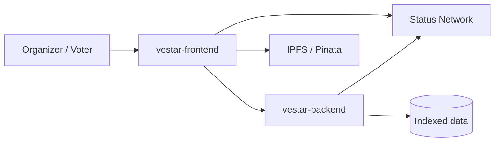
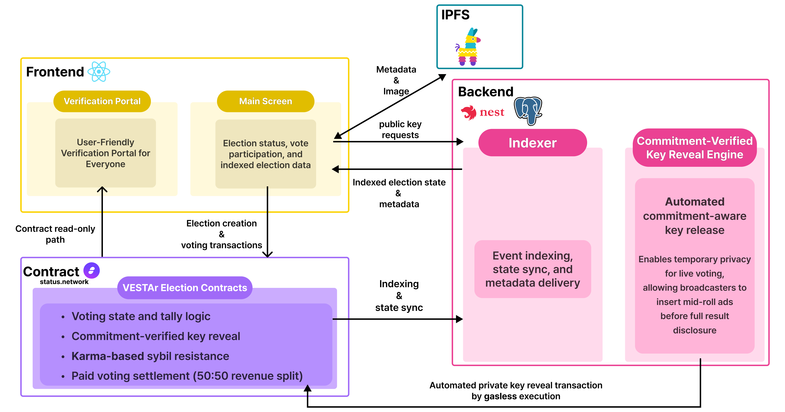
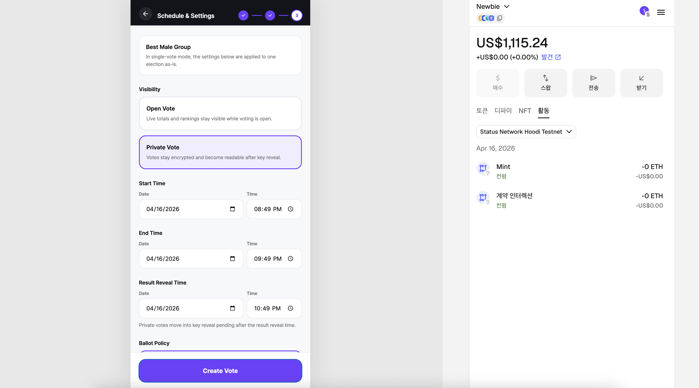
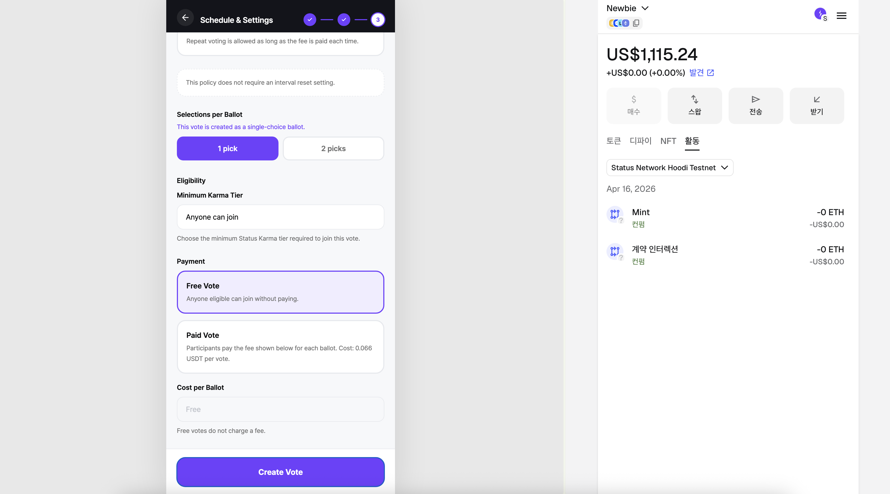

  

  

# VESTAr Frontend

Mobile-first frontend for VESTAr, an onchain K-pop voting platform built for vote creation, participation, and public verification.

  <a href="https://boisterous-sfogliatella-3e55f2.netlify.app/vote/">Live Demo</a>
  ·
  <a href="https://github.com/VESTAr-BAY/vestar-backend">Backend</a>
  ·
  <a href="https://github.com/VESTAr-BAY/vestar-contracts">Contracts</a>

## Related Repositories

| Repository | How it connects to this frontend |
| --- | --- |
| [`vestar-frontend`](https://github.com/VESTAr-BAY/vestar-frontend) | Main voting app, host flows, and verification portal UI |
| [`vestar-backend`](https://github.com/VESTAr-BAY/vestar-backend) | Indexed read APIs, private vote preparation, and automated key reveal flow |
| [`vestar-contracts`](https://github.com/VESTAr-BAY/vestar-contracts) | Status Network smart contracts for election creation, voting, tallying, and settlement |

## Project Description

**English**  
K-pop voting suffers from two core problems: lack of transparency and severe fragmentation. Fans are pushed across many competing apps, while centralized systems continue to create trust issues around fairness and manipulation. VESTAr solves both problems at once by combining a mobile-first product experience with onchain verification.

Built on Status Network, VESTAr gives organizers and fans a single place to create votes, participate in open or private voting, and verify results afterward. Private voting uses a commitment-verified key reveal flow, which keeps results hidden during live voting and makes them verifiable after the reveal step. This frontend is where that experience comes together for everyday users.

**한국어**  
K-pop 투표 시장은 투명성 부족과 심한 파편화라는 두 가지 문제를 안고 있습니다. 팬들은 여러 앱과 제한된 환경을 오가야 하고, 중앙화된 시스템은 공정성과 조작 논란에서 자유롭지 못합니다. VESTAr는 모바일 중심의 사용자 경험과 온체인 검증을 결합해 이 두 문제를 함께 해결하는 프로젝트입니다.

VESTAr는 Status Network 위에서 동작하며, 주최자는 투표를 만들고 팬들은 공개 투표와 비공개 투표에 참여할 수 있습니다. 또한 투표가 끝난 뒤에는 결과를 다시 검증할 수 있습니다. 특히 비공개 투표는 commitment-verified key reveal 흐름을 통해 진행 중에는 결과를 숨기고, 종료 후에는 누구나 검증 가능한 구조를 제공합니다. 이 프론트엔드는 그 전체 경험을 사용자가 가장 쉽게 만나는 접점입니다.

## What This Frontend Covers

**English**

- Create and manage votes from a mobile-friendly host flow.
- Join open or private votes from the main voting screens.
- View indexed results, live tally screens, and settlement-related host pages.
- Open the verification portal and inspect receipts, results, and proof data in one place.

**한국어**

- 모바일 친화적인 주최자 플로우에서 투표를 생성하고 관리합니다.
- 메인 투표 화면에서 공개 투표와 비공개 투표에 참여합니다.
- 인덱싱된 결과, 실시간 집계, 정산 관련 화면을 함께 제공합니다.
- 검증 포털에서 투표 기록, 결과, 검증 근거를 한곳에서 확인할 수 있습니다.

## Architecture

**English**  
This frontend sits between users and the rest of the VESTAr system. It sends wallet transactions to Status Network, uploads metadata and images to IPFS, and combines indexed backend data with onchain state for a clean product experience.

**한국어**  
이 프론트엔드는 사용자와 VESTAr 시스템 사이의 중심 화면 역할을 합니다. 지갑 트랜잭션은 Status Network로 전달하고, 이미지와 메타데이터는 IPFS에 올리며, 백엔드의 인덱싱 데이터와 온체인 상태를 합쳐 자연스러운 제품 경험을 제공합니다.

## Vote Flow

**English**  
The main voting experience is designed to feel familiar on mobile. Users can mint MockUSDT when needed, enter the vote flow, and submit votes through their wallet while the app keeps the steps easy to follow.

**한국어**  
메인 투표 경험은 모바일 환경에서 익숙하게 느껴지도록 설계되어 있습니다. 필요한 경우 MockUSDT를 먼저 민팅한 뒤 투표 플로우에 진입하고, 지갑을 통해 투표를 제출하는 과정을 앱이 자연스럽게 안내합니다.

  
  
  

## Create Vote Policy

**English**  
Organizers can shape the voting experience around the purpose of the event. The frontend makes it easy to choose visibility, ballot policy, and payment structure without exposing users to unnecessary complexity.

**한국어**  
주최자는 투표 목적에 맞게 공개 방식, 투표 정책, 결제 구조를 설정할 수 있습니다. 이 프론트엔드는 복잡한 설정을 어렵게 보이지 않도록 정리해, 필요한 정책을 직관적으로 선택할 수 있게 구성되어 있습니다.

### Visibility

**English**  
Open votes are suited for real-time transparency. Private votes keep ballots hidden during the voting period, then rely on the Commitment-Verified Key Reveal Engine so the final result can be revealed and verified afterward.

**한국어**  
공개 투표는 진행 중에도 결과 흐름을 보여주는 데 적합합니다. 비공개 투표는 투표 기간 동안 결과를 숨기고, 이후 Commitment-Verified Key Reveal Engine을 통해 최종 결과를 공개하고 검증할 수 있도록 설계되어 있습니다.

### Ballot Policy

**English**  
VESTAr supports one-per-election, one-per-interval, and unlimited paid voting. This gives organizers flexibility for everything from simple fan polls to repeated broadcast-style participation.

**한국어**  
VESTAr는 1회 투표, 주기별 1회 투표, 유료 무제한 투표를 지원합니다. 덕분에 단순한 팬 투표부터 방송형 반복 참여 구조까지 상황에 맞게 운영할 수 있습니다.

### Payment

**English**  
Free voting lowers participation friction, while paid voting brings the familiar broadcast voting model onchain in a more transparent form.

**한국어**  
무료 투표는 참여 장벽을 낮추고, 유료 투표는 기존 방송형 유료 투표 모델을 더 투명한 온체인 방식으로 옮겨온 구조입니다.

## Try Verification

**English**  
The verification portal is designed for people who are not deeply familiar with blockchain. It explains receipts, results, and proof data in plain language so users can follow how a result was produced.

For open votes, users can inspect the records directly. For private votes, the backend reveals the committed key after the vote ends, allowing users to reconstruct and verify the result in the same portal.

**한국어**  
검증 포털은 블록체인에 익숙하지 않은 사용자도 이해할 수 있도록 설계되어 있습니다. 투표 기록, 결과, 검증 근거를 쉬운 언어로 보여주어 결과가 어떻게 만들어졌는지 따라가며 확인할 수 있습니다.

공개 투표는 온체인 기록을 바로 확인할 수 있고, 비공개 투표는 종료 후 백엔드가 커밋된 키를 공개해 같은 포털 안에서 결과를 다시 복원하고 검증할 수 있습니다.

  
  
  

  
  

## Tech Snapshot

**English**  
This repository is built with React, TypeScript, Vite, Tailwind CSS, wagmi, and viem. It focuses on product delivery first: vote creation, participation, verification, and wallet-connected actions.

**한국어**  
이 저장소는 React, TypeScript, Vite, Tailwind CSS, wagmi, viem을 기반으로 구성되어 있습니다. 다만 README에서는 기술 스택보다 실제 제품 경험인 투표 생성, 참여, 검증, 지갑 연동 흐름에 더 초점을 두고 있습니다.

## Key Folders

| Path | Purpose |
| --- | --- |
| `src/pages` | Main app screens for voting and host flows |
| `src/features/verification` | Verification portal UI and helpers |
| `src/api` | Backend API clients |
| `src/contracts/vestar` | Chain config, ABI bindings, and contract actions |
| `readme_img` | README images and presentation assets |

## Local Development

**English**  
Install dependencies, configure the environment, and run the Vite dev server.

**한국어**  
의존성을 설치하고 환경 변수를 설정한 뒤 Vite 개발 서버를 실행하면 됩니다.

### Environment Variables

| Variable | Purpose |
| --- | --- |
| `VITE_API_BASE_URL` | Backend base URL for election, tally, history, and private prepare APIs |
| `VITE_PINATA_JWT` or `PINATA_JWT` | Token used for IPFS uploads |
| `VITE_PINATA_GATEWAY_URL` or `PINATA_GATEWAYS` | Gateway list for resolving `ipfs://` assets |

### Commands

| Command | Description |
| --- | --- |
| `pnpm install` | Install dependencies |
| `pnpm dev` | Start the local Vite dev server |
| `pnpm build` | Build the app with the verification portal when available |
| `pnpm build:app` | Build only the frontend app |
| `pnpm preview` | Preview the production build |
| `pnpm test` | Run unit tests |
| `pnpm check` | Run Biome checks |

## Notice

**English**  
At the time of submission, due to an issue on Status Chain, gasless execution is not being applied consistently, so a paid gas fee warning modal may appear before transactions.

**한국어**  
제출 시점 기준으로 Status Chain 이슈 때문에 가스리스 실행이 안정적으로 적용되지 않고 있어, 트랜잭션 전에 유료 가스비 경고 모달이 표시될 수 있습니다.
