# VESTAr Backend Architecture

VESTAr 백엔드는 `PRIVATE` election의 prepare, on-chain 인덱싱, private ballot 복호화/검증, tally projection, state sync automation, key reveal automation을 담당한다.  
`OPEN` election 생성 자체는 프론트와 컨트랙트의 책임으로 보고, 백엔드 문서 기준 책임 범위는 `ElectionCreated` 인덱싱과 `OpenVoteSubmitted` 이후 수집/집계 파이프라인부터 시작한다.

## 시스템 구성 요소

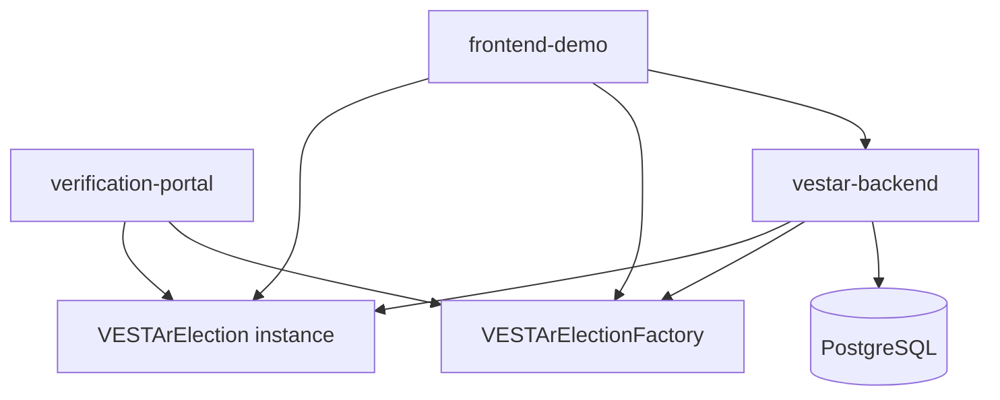

- `frontend-demo`
  - 이미지 업로드
  - `PRIVATE`일 때만 prepare 호출
  - `OPEN / PRIVATE` 모두 `createElection(...)` 직접 호출
  - `OPEN` 생성 상세 UX / allowlist 호출은 프론트 책임
  - `submitEncryptedVote(...)`, `submitOpenVote(...)` 직접 호출
- `vestar-backend`
  - draft/series/key/candidate 저장
  - on-chain election 인덱싱
  - private submission 복호화/검증
  - live tally / result summary projection
  - state sync worker
  - key reveal worker
- `verification-portal`
  - 온체인 상태/이벤트/공개된 private key 기준 검증
- `Factory`
  - election 인스턴스 생성
- `Election instance`
  - 실제 투표, 상태 전이, private key reveal, finalize 수행

## 현재 데이터 모델

- `election_series`
  - 상위 시리즈 단위
  - `series_preimage`, `onchain_series_id`, `cover_image_url`
- `election_drafts`
  - 오프체인 준비 단위
  - `title`, `cover_image_url`, `candidate_manifest_preimage`, `sync_state`
- `election_keys`
  - draft별 공개키 / private key commitment / encrypted private key
- `election_candidates`
  - draft별 후보 목록
  - `candidate_key`, `image_url`, `display_order`
- `onchain_elections`
  - 실제 컨트랙트 단위
  - `onchain_election_id`, `onchain_election_address`, `onchain_series_id`, `onchain_state`
- `open_vote_submissions`
  - open election 전용 제출 기록
- `vote_submissions`
  - private election 전용 제출 기록
- `decrypted_ballots`
- `invalid_ballots`
- `invalid_onchain_elections`
- `live_tally`
- `finalized_tally`
- `result_summaries`
- `indexer_cursors`

## 투표 생성 Flow

### Private election 생성

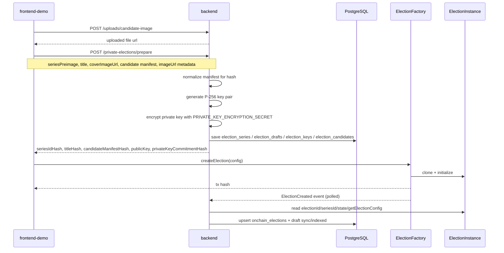

- `PRIVATE` election은 prepare를 통해 draft/series/key/candidate를 먼저 저장한다.
- `candidateManifestHash`는 이미지가 제외된 canonical manifest로 계산한다.
- create tx는 프론트가 직접 보낸다.
- 인덱서는 `ElectionCreated`를 읽어 `onchain_elections`를 확정한다.

### Open election 생성에 대한 백엔드 경계

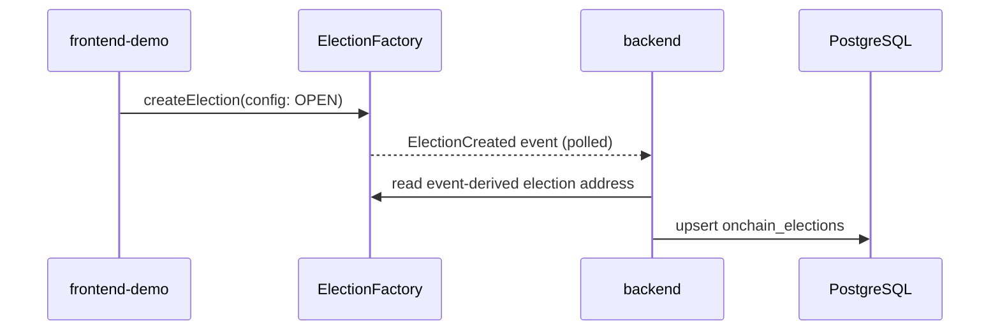

- `OPEN` 생성 상세 절차는 이 문서의 범위가 아니다.
- 백엔드가 아는 최초 시점은 `ElectionCreated`가 체인에 찍힌 이후다.
- 이후 백엔드는 해당 election을 `onchain_elections`에 수집하고, `OpenVoteSubmitted`부터 집계 파이프라인을 시작한다.

## 투표 Flow

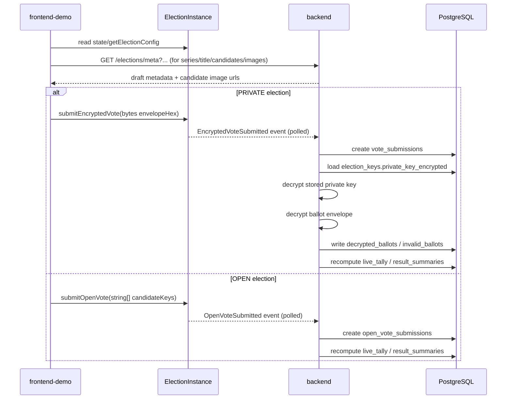

- `PRIVATE`
  - `vote_submissions` -> `decrypted_ballots` / `invalid_ballots` -> `live_tally` -> `result_summaries`
- `OPEN`
  - `open_vote_submissions` -> `live_tally` -> `result_summaries`

## Live Tally Flow

```mermaid
flowchart TD
  A{visibilityMode}
  A -- PRIVATE --> B[EncryptedVoteSubmitted]
  B --> C[vote_submissions upsert]
  C --> D[private key decrypt]
  D --> E[ballot envelope decrypt]
  E --> F{payload valid?}
  F -- yes --> G[decrypted_ballots is_valid=true]
  F -- no --> H[invalid_ballots 생성]
  G --> I[live_tally 전체 재계산]
  H --> I
  A -- OPEN --> J[OpenVoteSubmitted]
  J --> K[getTransaction(txHash)]
  K --> L[decode submitOpenVote(string[])]
  L --> M[open_vote_submissions upsert]
  M --> I
  I --> N[result_summaries 재계산]
```

- `live_tally`는 증분 카운트가 아니라 source 테이블 기준 전체 재계산이다.
- `PRIVATE`
  - `vote_submissions` -> `decrypted_ballots / invalid_ballots` -> `live_tally` -> `result_summaries`
- `OPEN`
  - `open_vote_submissions` -> `live_tally` -> `result_summaries`

## Key Reveal Flow

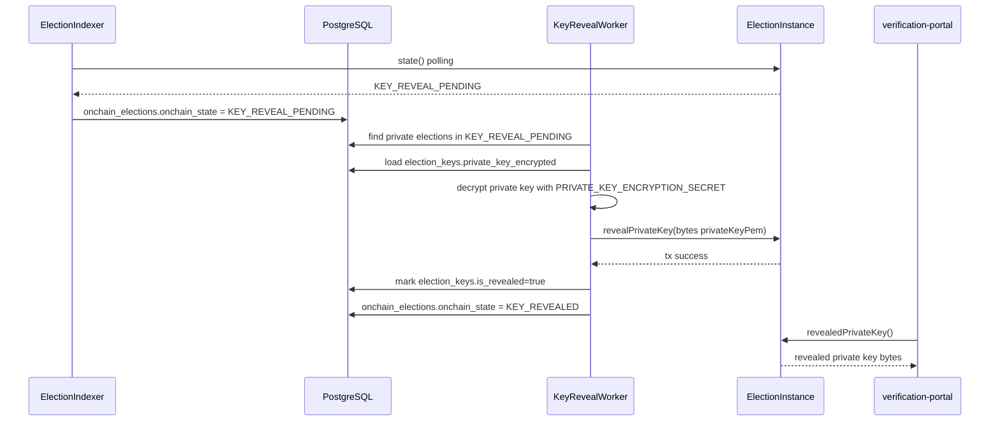

- 검증 포털의 권장 경로는 백엔드가 아니라 온체인 `revealedPrivateKey()` 조회다.
- 다만 현재 백엔드에는 운영/디버깅 용도의 `GET /elections/revealed-private-key` 엔드포인트가 별도로 존재한다.
- 백엔드는 `KEY_REVEAL_PENDING`에서 온체인 `revealPrivateKey(bytes)`만 수행한다.
- 이후 검증 포털은 온체인 `revealedPrivateKey()`만 읽어 자체 복호화해야 한다.

## Finalized Tally Flow

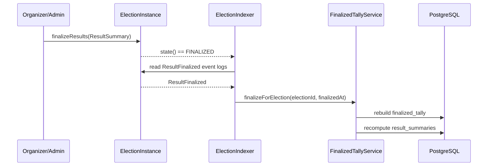

- `finalized_tally`는 백엔드가 상태를 바꿔서 만드는 것이 아니다.
- 먼저 organizer/admin 등 권한 있는 주체가 온체인 `finalizeResults(ResultSummary)`를 호출해 election을 `FINALIZED` 상태로 만들어야 한다.
- 백엔드는 그 이후 `FINALIZED` 상태와 `ResultFinalized` 이벤트를 감지해 projection으로서 `finalized_tally`를 생성한다.
- 즉 온체인 finalize가 선행되고, 백엔드 `finalized_tally`는 그 결과를 후행 반영한다.

## 인덱서 Flow

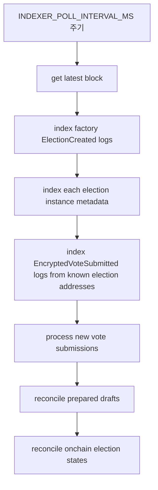

- 팩토리 쪽
  - `ElectionCreated` polling
  - 각 election의 `state()`, `getElectionConfig()` 읽기
  - `onchain_elections` upsert
- 투표 쪽
  - known election address 기준 `EncryptedVoteSubmitted` polling
  - tx input decode로 `encryptedBallot` 추출
  - `vote_submissions` 저장
  - known election address 기준 `OpenVoteSubmitted` polling
  - tx input decode로 `candidateKeys` 추출
  - `open_vote_submissions` 저장
- 상태 재동기화
  - 인덱서가 `simulateContract(syncState)`로 다음 live state를 계산
  - `SCHEDULED`, `ACTIVE`, `CLOSED`, `KEY_REVEAL_PENDING`로 바뀌면 `is_state_syncing = true`와 `last_state_sync_requested_at`를 기록
  - `state-sync-worker`가 `syncState()` tx를 보내 on-chain snapshot을 실제 상태로 맞춘다
  - `FINALIZED` 감지 시 `ResultFinalized` 이벤트 블록 timestamp를 읽고 `finalized_tally` 생성
  - 단, `FINALIZED` 자체는 organizer/admin 등의 온체인 `finalizeResults(ResultSummary)` 호출이 먼저 있어야 한다
- draft 없는 on-chain election
  - `onchain_elections`는 먼저 생성
  - `onchainSeriesId` 저장
  - `election_series`는 fallback `NA <seriesId>` 생성 가능
  - `invalid_onchain_elections`에 `MISSING_DRAFT_MAPPING` 기록

## API와 DTO 정리

### `POST /uploads/candidate-image`

이미지 업로드 후 URL을 반환한다.

요청 형식:

- `Content-Type: multipart/form-data`
- form field name: `file`
- 파일 조건:
  - `image/*` mime type만 허용
  - 최대 `5MB`

```json
{
  "url": "http://localhost:3000/uploads/candidate-images/1775565933845-....jpeg"
}
```

### `POST /private-elections/prepare`

요청 DTO:

```ts
type PreparePrivateElectionRequest = {
  seriesPreimage: string;
  seriesCoverImageUrl?: string | null;
  title: string;
  coverImageUrl?: string | null;
  candidateManifestPreimage: {
    candidates: Array<{
      candidateKey: string;
      displayOrder: number;
      imageUrl?: string | null;
    }>;
  };
};
```

응답 DTO:

```ts
type PreparePrivateElectionResponse = {
  seriesIdHash: `0x${string}`;
  titleHash: `0x${string}`;
  candidateManifestHash: `0x${string}`;
  keySchemeVersion: number;
  publicKey: {
    format: "pem";
    algorithm: "ECDH-P256";
    value: string;
  };
  privateKeyCommitmentHash: `0x${string}`;
  candidateManifestPreimage: {
    candidates: Array<{
      candidateKey: string;
      displayOrder: number;
    }>;
  };
};
```

### `GET /elections/meta`

`Submit Vote`가 온체인 election에 붙일 DB 메타데이터를 가져올 때 사용하는 전용 API다.

중요:

- 이 엔드포인트는 **단일 객체가 아니라 배열**을 반환한다.
- 프론트는 보통 `onchainElectionId` 또는 `onchainElectionAddress`로 조회한 뒤 첫 번째 원소를 사용한다.

지원 query:

- `seriesId?: string`
- `onchainElectionId?: string`
- `onchainElectionAddress?: string`
- `syncState?: "PREPARED" | "INDEXED" | "EXPIRED" | "FAILED"`
- `visibilityMode?: "OPEN" | "PRIVATE"`

```ts
type ElectionMetadataItem = {
  id: string;
  draftId: string | null;
  onchainSeriesId: string | null;
  onchainElectionId: string | null;
  onchainElectionAddress: string | null;
  title: string | null;
  coverImageUrl: string | null;
  series: {
    id: string;
    seriesPreimage: string;
    onchainSeriesId?: string | null;
    coverImageUrl?: string | null;
  } | null;
  electionKey: {
    publicKey: string;
  } | null;
  electionCandidates: Array<{
    id: string;
    candidateKey: string;
    imageUrl: string | null;
      displayOrder: number;
  }>;
};

type GetElectionMetadataResponse = ElectionMetadataItem[];
```

### `GET /elections/revealed-private-key?onchainElectionId=0x...`

운영/디버깅 용도로 reveal 시각 이후 DB에 저장된 encrypted private key를 복호화해 반환한다.

```ts
type RevealedPrivateKeyResponse = {
  onchainElectionId: string;
  onchainElectionAddress: string;
  resultRevealAt: string;
  privateKey: string;
  privateKeyCommitmentHash: string;
};
```

주의:

- 현재 검증 포털의 권장 경로는 이 API가 아니라 온체인 `revealedPrivateKey()` 조회다.
- 이 엔드포인트는 백엔드 내부 운영/디버깅 편의를 위해 존재한다.

### `GET /elections`

`Live Tally`, `Tally Detail`, 생성 후 인덱싱 확인 같은 화면이 사용하는 범용 summary API다.

중요:

- 이 엔드포인트도 **배열**을 반환한다.

지원 query:

- `seriesId?: string`
- `onchainElectionId?: string`
- `onchainElectionAddress?: string`
- `syncState?: "PREPARED" | "INDEXED" | "EXPIRED" | "FAILED"`
- `onchainState?: "SCHEDULED" | "ACTIVE" | "CLOSED" | "KEY_REVEAL_PENDING" | "KEY_REVEALED" | "FINALIZED" | "CANCELLED"`
- `visibilityMode?: "OPEN" | "PRIVATE"`

```ts
type IndexedElectionItem = {
  id: string;
  draftId: string | null;
  onchainElectionId: string;
  onchainElectionAddress: string;
  organizerWalletAddress: string;
  organizerVerifiedSnapshot: boolean;
  visibilityMode: "PRIVATE" | "OPEN";
  paymentMode: "FREE" | "PAID";
  ballotPolicy: "ONE_PER_ELECTION" | "ONE_PER_INTERVAL" | "UNLIMITED_PAID";
  startAt: string;
  endAt: string;
  resultRevealAt: string;
  minKarmaTier: number;
  resetIntervalSeconds: number;
  allowMultipleChoice: boolean;
  maxSelectionsPerSubmission: number;
  timezoneWindowOffset: number;
  paymentToken: string | null;
  costPerBallot: string;
  onchainState: string;
  isStateSyncing: boolean;
  lastStateSyncRequestedAt: string | null;
  lastStateSyncTxHash: string | null;
  onchainSeriesId: string | null;
  title: string | null;
  coverImageUrl: string | null;
  syncState: string | null;
  series: {
    id: string;
    seriesPreimage: string;
    onchainSeriesId: string | null;
    coverImageUrl?: string | null;
  } | null;
  electionKey: {
    publicKey: string;
  } | null;
  electionCandidates: Array<{
    id: string;
    candidateKey: string;
    imageUrl: string | null;
    displayOrder: number;
  }>;
  validDecryptedBallotCount: number;
  resultSummary: {
    id: string;
    totalSubmissions: number;
    totalDecryptedBallots: number;
    totalValidVotes: number;
    totalInvalidVotes: number;
    createdAt: string;
  } | null;
};

type GetElectionsResponse = IndexedElectionItem[];
```

### `GET /vote-submissions/by-tx-hash?txHash=0x...`

프론트가 tx hash 기준으로 private submission 적재/복호화 상태를 확인할 때 쓴다.

중요:

- `txHash`가 없으면 `null`
- row가 아직 없으면 `null`

```ts
type VoteSubmissionStatus = {
  id: string;
  onchainTxHash: string;
  voterAddress: string;
  blockNumber: number;
  blockTimestamp: string;
  onchainElection: {
    id: string;
    onchainElectionId: string;
    onchainElectionAddress: string;
    onchainState: string;
    draft: {
      id: string;
      title: string;
      series: {
        id: string;
        seriesPreimage: string;
      };
    } | null;
  };
  decryptedBallot: {
    id: string;
    candidateKeys: string[];
    nonce: string;
    isValid: boolean;
    validatedAt: string | null;
    createdAt: string;
  } | null;
  invalidBallots: Array<{
    id: string;
    reasonCode: string;
    reasonDetail: string | null;
    createdAt: string;
  }>;
} | null;
```

### `GET /live-tally?electionId=<db onchainElection id>`

현재 집계 projection을 반환한다.

```ts
type LiveTallyRow = Array<{
  id: string;
  onchainElectionId: string;
  candidateKey: string;
  count: number;
  updatedAt: string;
}>;
```

### `GET /finalized-tally?electionId=<db onchainElection id>`

최종 집계 projection을 반환한다.

```ts
type FinalizedTallyRow = Array<{
  id: string;
  onchainElectionId: string;
  candidateKey: string;
  count: number;
  voteRatio: number;
  finalizedAt: string;
}>;
```

### `GET /result-summaries?electionId=<db onchainElection id>`

요약 수치를 반환한다.

```ts
type ResultSummaryRow = Array<{
  id: string;
  onchainElectionId: string;
  totalSubmissions: number;
  totalDecryptedBallots: number;
  totalValidVotes: number;
  totalInvalidVotes: number;
  createdAt: string;
}>;
```

## 에러 응답 형식

현재 Nest 기본 예외와 수동 `BadRequestException`을 그대로 사용하므로, 프론트는 아래 shape를 기준으로 처리하는 편이 안전하다.

```ts
type ErrorResponse = {
  statusCode: number;
  message: string | string[];
  error?: string;
};
```

대표 예시:

```json
{
  "statusCode": 400,
  "message": "seriesPreimage must be a non-empty string",
  "error": "Bad Request"
}
```

프론트 권장 처리:

- `message`가 배열이면 join해서 표시
- `message`가 문자열이면 그대로 표시
- 둘 다 없으면 raw body 또는 HTTP status fallback 사용

## DB 구조 ERD

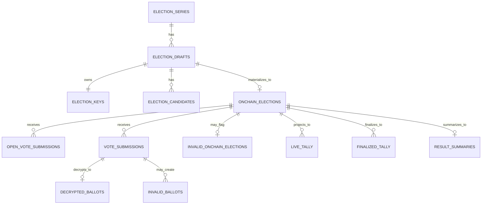

## 컨트랙트 구조

### Factory와 Election 역할

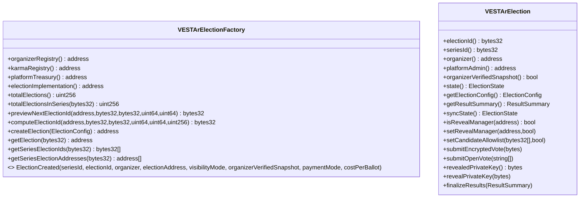

### ElectionConfig의 핵심 필드

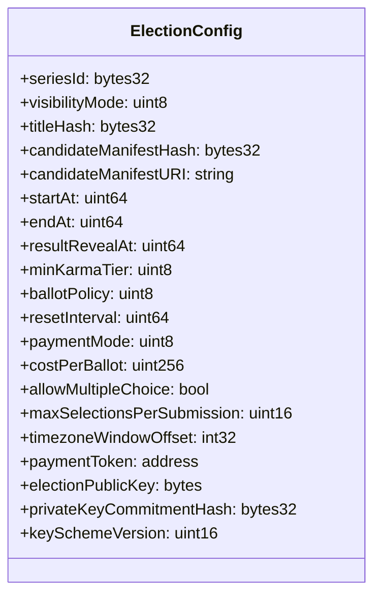

주의:
- 최신 컨트랙트에서는 `electionId`를 프론트가 config에 넣지 않는다.
- factory가 내부적으로 `computeElectionId(...)`로 `electionId`를 생성한다.

### ElectionState

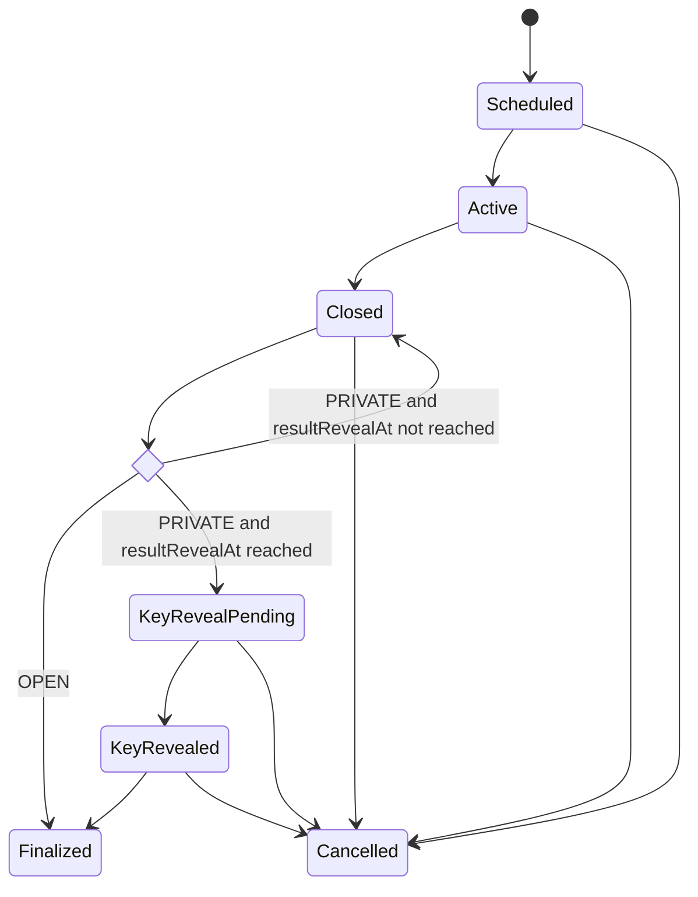

현재 온체인 enum 순서:

- `0 = Scheduled`
- `1 = Active`
- `2 = Closed`
- `3 = KeyRevealPending`
- `4 = KeyRevealed`
- `5 = Finalized`

추가 메모:

- `PRIVATE` election은 `endAt` 직후 곧바로 `KeyRevealPending`이 되는 것이 아니다.
- 실제 컨트랙트 live state는 `resultRevealAt` 전까지 `Closed`를 유지하고, 그 이후 `KeyRevealPending`으로 전이된다.
- `6 = Cancelled`

설명:
- `OPEN` election은 `Closed -> Finalized`로 바로 갈 수 있다.
- `PRIVATE` election만 `KeyRevealPending -> KeyRevealed -> Finalized` 경로를 탄다.
- 최신 컨트랙트 기준 `Cancelled`는 `Scheduled`뿐 아니라 이후 상태에서도 도달 가능하다.
