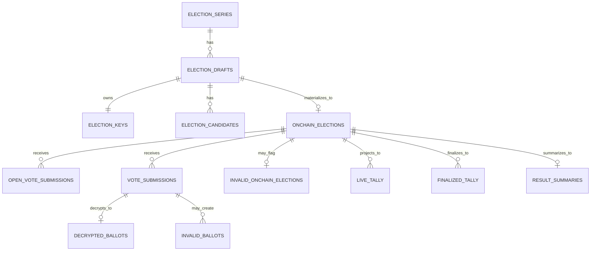

# VESTAr Backend DB Schema

## 목적

이 문서는 현재 `vestar-backend`의 실제 DB 구조를 설명한다.

핵심 원칙:

- `series`는 상위 이벤트/주최 단위다.
- `draft`는 오프체인 준비 단위다.
- `onchain_election`은 실제 컨트랙트 단위다.
- 후보/이미지/원문 메타는 draft에 속한다.
- submission/tally는 on-chain election에 속한다.
- `OPEN` election은 생성 시 백엔드 prepare를 거치지 않으므로, 백엔드 집계 파이프라인은 `open_vote_submissions`부터 시작한다.

## 테이블 목록

- `admin_users`
- `verified_organizers`
- `election_series`
- `election_drafts`
- `election_keys`
- `election_candidates`
- `onchain_elections`
- `invalid_onchain_elections`
- `open_vote_submissions`
- `vote_submissions`
- `decrypted_ballots`
- `invalid_ballots`
- `live_tally`
- `finalized_tally`
- `result_summaries`
- `indexer_cursors`

## 핵심 컬럼

### `election_series`

- `series_preimage`
- `onchain_series_id`
- `cover_image_url`

의미:

- `series_preimage`
  - 사람이 읽는 시리즈 문자열이면서, 온체인 `seriesId = keccak256(toHex(seriesPreimage))`를 만들 때 사용하는 preimage 원문이다.
- `onchain_series_id`
  - 실제 온체인에 저장되는 `bytes32 seriesId`다.

### `election_drafts`

- `series_id`
- `title`
- `cover_image_url`
- `candidate_manifest_preimage`
- `visibility_mode`
- `sync_state`

### `election_keys`

- `draft_id`
- `public_key`
- `private_key_commitment_hash`
- `private_key_encrypted`
- `is_revealed`
- `revealed_at`

### `election_candidates`

- `draft_id`
- `candidate_key`
- `image_url`
- `display_order`

### `onchain_elections`

- `draft_id`
- `onchain_series_id`
- `onchain_election_id`
- `onchain_election_address`
- `organizer_wallet_address`
- `organizer_verified_snapshot`
- `visibility_mode`
- `payment_mode`
- `ballot_policy`
- `start_at`
- `end_at`
- `result_reveal_at`
- `min_karma_tier`
- `reset_interval_seconds`
- `allow_multiple_choice`
- `max_selections_per_submission`
- `timezone_window_offset`
- `payment_token`
- `cost_per_ballot`
- `onchain_state`
- `is_state_syncing`
- `last_state_sync_requested_at`
- `last_state_sync_tx_hash`

의미:

- `draft_id`
  - `PRIVATE` prepare와 연결된 election이면 draft를 가리킨다.
  - `OPEN` election이나 draft 매핑 실패 election은 `null`일 수 있다.
- `onchain_series_id`
  - 체인에서 읽은 실제 `seriesId` snapshot이다.
- `is_state_syncing`
  - 인덱서가 live state 변화를 감지했고 state-sync worker가 `syncState()` tx를 보내야 하는 상태인지 표시한다.
- `last_state_sync_requested_at`
  - 인덱서가 state sync 필요를 마지막으로 기록한 시각이다.
- `last_state_sync_tx_hash`
  - worker가 마지막으로 보낸 `syncState()` tx hash다.

### `invalid_onchain_elections`

- `onchain_election_id_ref`
- `reason_code`
- `reason_detail`

의미:

- 인덱싱된 on-chain election이 로컬 draft와 매핑되지 않을 때 기록한다.
- 현재 대표 reason은 `MISSING_DRAFT_MAPPING` 이다.

### `open_vote_submissions`

- `onchain_election_id_ref`
- `onchain_tx_hash`
- `voter_address`
- `block_number`
- `block_timestamp`
- `candidate_keys`
- `selection_count`
- `ballots_spent`
- `payment_amount`

의미:

- `OPEN` election 전용 submission 저장소다.
- 생성 시점에 백엔드가 관여하지 않더라도, 인덱서가 `OpenVoteSubmitted`와 tx input을 읽어 이 테이블부터 채운다.
- 이후 `live_tally`, `result_summaries`, `finalized_tally`의 source of truth로 사용된다.

### `vote_submissions`

- `onchain_election_id_ref`
- `onchain_tx_hash`
- `voter_address`
- `block_number`
- `block_timestamp`
- `encrypted_ballot`

의미:

- `PRIVATE` election 전용 submission 저장소다.
- `encrypted_ballot`와 이후 `decrypted_ballots` 파이프라인에 연결된다.

### `decrypted_ballots`

- `vote_submission_id`
- `candidate_keys`
- `nonce`
- `is_valid`

### `result_summaries`

- `onchain_election_id_ref`
- `total_submissions`
- `total_decrypted_ballots`
- `total_valid_votes`
- `total_invalid_votes`

## 상태 필드

### `election_drafts.sync_state`

- `PREPARED`
- `INDEXED`
- `EXPIRED`
- `FAILED`

의미:

- `PREPARED`: 원문 저장 및 key 생성 완료
- `INDEXED`: on-chain election과 연결 완료
- `EXPIRED`: 준비 후 일정 시간 내 생성되지 않음
- `FAILED`: prepare 또는 연결 파이프라인 실패

### `onchain_elections.onchain_state`

- `SCHEDULED`
- `ACTIVE`
- `CLOSED`
- `KEY_REVEAL_PENDING`
- `KEY_REVEALED`
- `FINALIZED`
- `CANCELLED`

이 값은 컨트랙트 `ElectionState`를 그대로 반영한다.

### `onchain_elections.is_state_syncing`

- `true`
  - 인덱서가 `simulateContract(syncState)` 기준 상태 차이를 감지했고 worker가 write tx를 보내야 한다.
- `false`
  - 추가 `syncState()` write가 필요 없거나 이미 처리됐다.

## 이미지 저장 규칙

- `election_series.cover_image_url`
  - series 배너 이미지 URL
- `election_drafts.cover_image_url`
  - election 대표 배너 이미지 URL
- `election_candidates.image_url`
  - 후보 이미지 URL

이 이미지 URL들은 DB/UI용 메타데이터다.
현재 `candidateManifestHash` 계산에는 후보 이미지 URL이 포함되지 않는다.

## 관계

