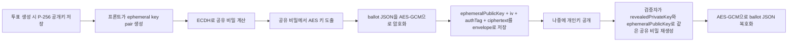
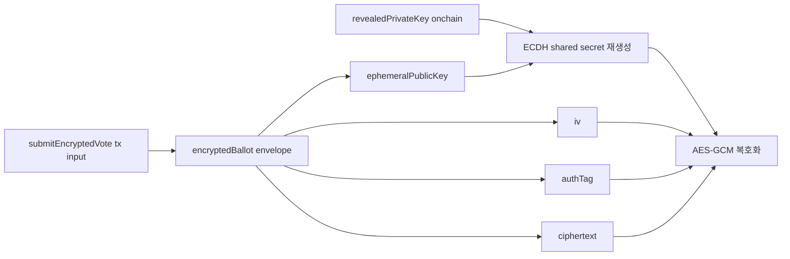
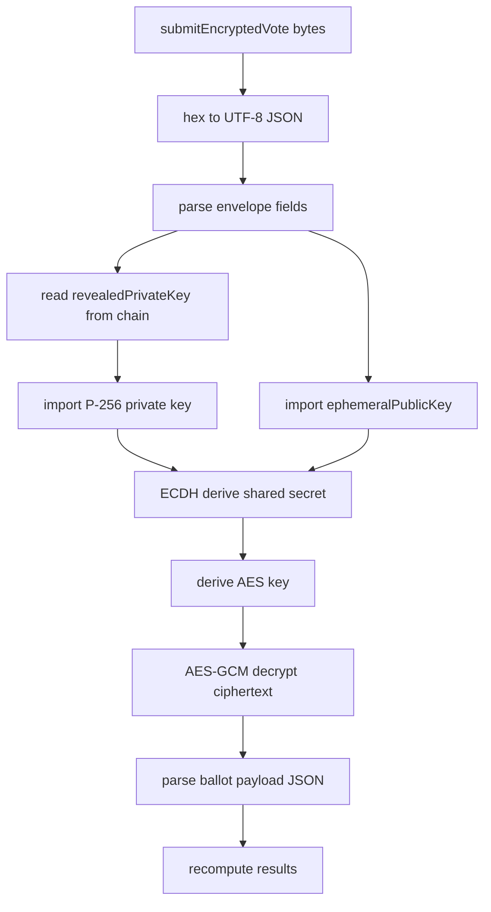

# VESTAr Private Election ECC Architecture

이 문서는 현재 VESTAr 프라이빗 투표 구조가 `RSA로 바로 암호화 후 나중에 개인키로 직접 복호화`하는 구조가 아니라, `ECC(P-256 ECDH) + AES-256-GCM` 하이브리드 구조라는 점을 설명하기 위한 암호화 전용 문서다.

핵심 결론:

- 현재 `frontend-demo`는 `P-256 공개키`를 사용해 `ECDH 공유 비밀`을 만들고, 그 공유 비밀에서 대칭키를 도출해 `AES-GCM`으로 ballot payload를 암호화한다.
- 즉, 포털이 나중에 결과를 독립 검증하려면 `RSA 스타일 직접 복호화`를 기대하면 안 되고, `revealedPrivateKey + encryptedBallot envelope(ephemeralPublicKey, iv, authTag, ciphertext)`를 사용해 같은 공유 비밀을 다시 계산한 뒤 AES-GCM 복호화를 해야 한다.
- 따라서 `vestar-verification-portal`의 기존 구형 compact 포맷 복호화 로직은 현재 시스템과 맞지 않으며, 현행 ECC+AES 포맷에 맞게 바뀌어야 한다.

## 1. 왜 RSA가 아니라 ECC+AES인가

### 1.1 팀이 생각한 구조


이건 RSA 사고방식에 가깝다.

### 1.2 현재 실제 구조



즉 현재 구조는 `ECC로 직접 메시지를 복호화`하는 구조가 아니라, `ECC는 공유 비밀 재생성`, `실제 메시지 암복호화는 AES-GCM`이 담당한다.

추가로 중요한 점은, 이 구조에서 나중에 검증자가 다시 복호화할 때 필요한 재료가 이미 온체인과 DB에 나뉘어 존재한다는 점이다.

- 온체인에 공개되는 것
  - `submitEncryptedVote(bytes encryptedBallot)`의 tx input 안의 `encryptedBallot`
  - 이 `encryptedBallot` 안에는 envelope 전체가 들어 있다
  - 즉 `ephemeralPublicKey`, `iv`, `authTag`, `ciphertext`는 결국 온체인 tx input으로 공개된다
- DB에 저장되는 것
  - 백엔드는 tx input에서 추출한 `encryptedBallot`를 `vote_submissions.encrypted_ballot`에도 저장한다
  - 따라서 검증/집계 파이프라인은 DB에서 다시 읽기 쉽다
- reveal 시점에 새로 공개되는 것
  - `revealedPrivateKey()`를 통해 election private key만 온체인에 공개된다

즉 검증 시점에 필요한 퍼즐 조각은 다음처럼 맞춰진다.



따라서 나중에 검증자가 해야 하는 일은 `온체인에서 private key만 새로 얻고`, 기존에 이미 온체인 tx input에 공개되어 있던 envelope를 다시 찾아 복호화하는 것이다.  
즉 reveal 시점에 envelope를 새로 공개하는 것이 아니라, **원래 제출 때부터 envelope는 온체인 tx input으로 공개되어 있고, reveal 시점에는 그걸 풀 수 있는 private key만 공개된다.**

### 1.3 왜 이렇게 했는가

- 온체인에 저장하는 공개키 크기를 줄이기 위해
- 브라우저 WebCrypto에서 표준적으로 다루기 쉬운 방식이기 때문에
- RSA보다 공개키가 훨씬 작아서 calldata/storage 비용 측면에서 유리하기 때문에
- 나중에 개인키를 공개했을 때 누구나 동일한 복호화를 재현할 수 있기 때문에

대략 비교:

- RSA 2048 public key: 수백 바이트
- P-256 public key: 수십~100바이트 수준

따라서 이 시스템에서 포털이 바뀌어야 하는 이유는 단순하다.

> 지금 포털은 `RSA처럼 직접 풀리는 구조` 또는 `예전 compact 포맷`을 가정하고 있고, 실제 운영 중인 프론트는 `ECC+AES envelope`를 생성한다.

## 2. 프론트가 실제로 만드는 envelope

현재 `frontend-demo/src/lib/crypto.ts` 기준 envelope:

```json
{
  "algorithm": "ecdh-p256-aes-256-gcm",
  "ephemeralPublicKey": "<base64 spki>",
  "iv": "<base64>",
  "authTag": "<base64>",
  "ciphertext": "<base64>"
}
```

암호화 대상 ballot payload:

```json
{
  "schemaVersion": 1,
  "electionId": "0x...",
  "chainId": 1660990954,
  "electionAddress": "0x...",
  "voterAddress": "0x...",
  "candidateKeys": ["임영웅"],
  "nonce": "0x..."
}
```

이 JSON envelope 전체가 UTF-8 문자열이 되고, 그 문자열이 다시 hex bytes로 바뀌어 `submitEncryptedVote(bytes)`에 들어간다.

## 3. 해시와 메타데이터 분리 규칙

### 3.1 온체인 해시 대상

`candidateManifestHash` 계산 대상:

```json
{
  "candidates": [
    {
      "candidateKey": "임영웅",
      "displayOrder": 1
    },
    {
      "candidateKey": "아이유",
      "displayOrder": 2
    }
  ]
}
```

### 3.2 해시 비대상

다음은 DB/UI 메타데이터다.

- `seriesCoverImageUrl`
- `coverImageUrl`
- `election_candidates.image_url`

이 값들은 UI 렌더링용이고, 온체인 hash에 포함되지 않는다.

### 3.3 왜 분리했는가

- 이미지 경로나 CDN이 바뀌어도 온체인 무결성이 깨지지 않게 하기 위해
- 후보 이름/순서 같은 투표 본질 데이터와 UI 자산을 분리하기 위해
- 검증 포털이 결과 검증 시 이미지 URL 같은 비본질 메타데이터에 의존하지 않게 하기 위해

## 4. 포털이 바뀌어야 하는 이유

현재 포털의 문제:

- 구형 compact private ballot 포맷을 기대한다.
- `frontend-demo`가 실제로 올리는 JSON envelope를 해석하지 못한다.
- 따라서 개인키가 온체인에 공개되어도 현재 구조에선 `암호문 풀어 결과 보기`가 제대로 동작하지 않는다.

포털이 해야 할 일:



즉 포털이 바뀌어야 하는 포인트는 다음 하나다.

> `RSA식 직접 복호화` 또는 `구형 compact 포맷 복호화`가 아니라, `ECC+AES envelope 복호화`를 구현해야 한다.

## 5. 최종 요약

- 현재 시스템은 `RSA direct encryption` 구조가 아니다.
- 현재 시스템은 `P-256 ECDH + AES-256-GCM` 하이브리드 구조다.
- 프론트는 public key로 ballot JSON을 envelope 형태로 암호화해 온체인에 제출한다.
- reveal 시점에는 worker가 개인키를 온체인에 공개한다.
- 검증 포털은 백엔드에 의존하지 않고 온체인 `revealedPrivateKey()`와 `encryptedBallot`만으로 결과를 재계산해야 한다.
- 따라서 포털 복호화 로직은 반드시 현재 ECC+AES 포맷에 맞게 변경되어야 한다.
