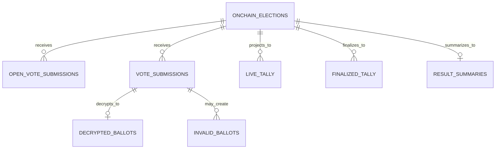
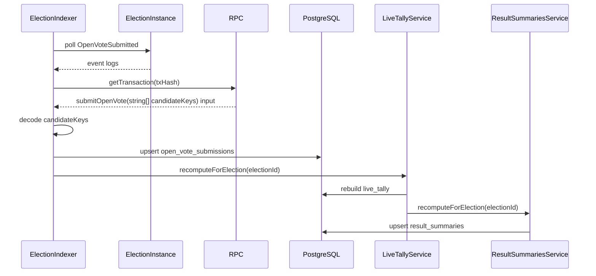
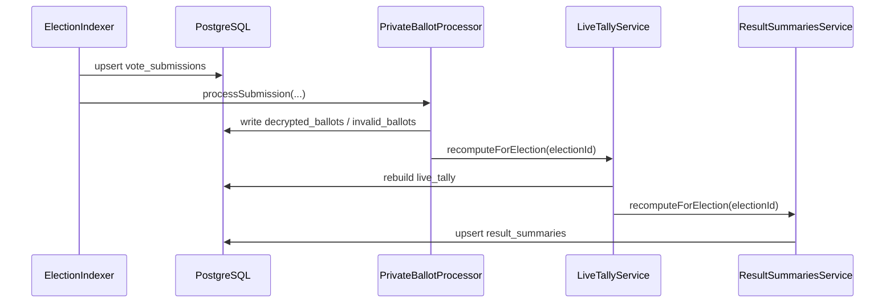
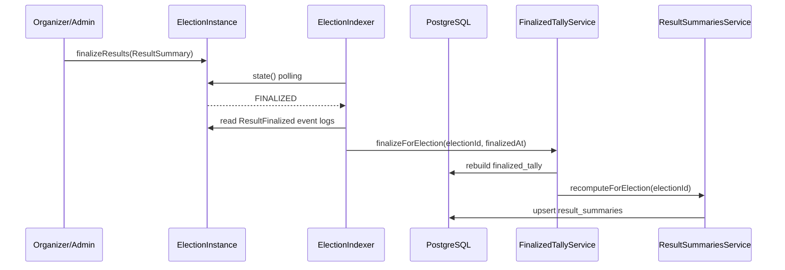

# VESTAr Tally Pipelines Spec

이 문서는 VESTAr 백엔드에서 `OPEN` / `PRIVATE` election 집계를 어떤 source of truth로 만들고,  
어떤 시점에 `live_tally`, `finalized_tally`, `result_summaries`를 갱신하는지 설명하는 **현재 구현 기준 문서**다.  
`OPEN` election 생성 UX와 생성 직후 allowlist 등록은 이 문서 범위가 아니며, 백엔드 관점의 시작점은 `ElectionCreated` 인덱싱과 `OpenVoteSubmitted` 수집부터다.

---

## 1. 목표

이 문서의 구현 목표는 두 가지다.

1. `OPEN` election도 백엔드가 수집/집계할 수 있게 한다.
2. `OPEN` / `PRIVATE` 모두에 대해 `FINALIZED` 시점 최종 집계 파이프라인을 완성한다.

최종 결과:

- `OPEN`
  - `OpenVoteSubmitted`
  - `open_vote_submissions`
  - `live_tally`
  - `result_summaries`
  - `finalized_tally`
- `PRIVATE`
  - 기존 `vote_submissions`
  - `decrypted_ballots`
  - `live_tally`
  - `result_summaries`
  - `finalized_tally`

를 visibility별로 일관되게 운영한다.

---

## 2. 현재 상태

### 2.1 현재 구현된 것

- `PRIVATE` election 생성 prepare
- `ElectionCreated` 인덱싱
- `EncryptedVoteSubmitted` 인덱싱
- `OpenVoteSubmitted` 인덱싱
- `vote_submissions` 저장
- `open_vote_submissions` 저장
- private ballot 복호화 / 검증
- `decrypted_ballots`, `invalid_ballots`
- `live_tally`
- `result_summaries`
- `finalized_tally`
- key reveal worker
- state sync worker

즉 현재 백엔드는 `OPEN` / `PRIVATE` 모두 집계를 생성한다.

---

## 3. 핵심 설계 원칙

### 3.1 source of truth는 visibility마다 다르다

- `OPEN`
  - 후보 선택 원문은 온체인 tx input `submitOpenVote(string[] candidateKeys)`
  - source of truth는 `open_vote_submissions`
- `PRIVATE`
  - 후보 선택 원문은 복호화된 ballot payload
  - source of truth는 `decrypted_ballots.is_valid = true`

### 3.2 테이블 역할은 섞지 않는다

- `vote_submissions`
  - private 전용
- `decrypted_ballots`
  - private 전용
- `open_vote_submissions`
  - open 전용

`OPEN`을 private 테이블에 억지로 넣지 않는다.

### 3.3 projection 테이블은 공통으로 쓴다

아래 테이블은 visibility와 무관하게 공통 projection으로 유지한다.

- `live_tally`
- `finalized_tally`
- `result_summaries`

단, **source를 고르는 방식만 visibility에 따라 분기**한다.

### 3.4 최종 집계는 FINALIZED에서만 만든다

- `live_tally`
  - 진행 중 집계
- `finalized_tally`
  - `FINALIZED` 상태일 때만 생성/갱신

`KEY_REVEALED`는 private에서 복호화가 가능해진 상태일 뿐, 최종 집계 확정 상태는 아니다.

중요:

- 백엔드는 election을 `FINALIZED`로 직접 바꾸지 않는다.
- 먼저 organizer/admin 등 권한 있는 주체가 온체인 `finalizeResults(ResultSummary)`를 호출해야 한다.
- 백엔드는 그 결과로 바뀐 `FINALIZED` 상태를 polling으로 감지해 `finalized_tally`를 생성한다.
- `SCHEDULED -> ACTIVE`, `ACTIVE -> CLOSED`, `CLOSED -> KEY_REVEAL_PENDING` 같은 시간 기반 전이는 인덱서가 off-chain으로 감지하고, 별도 state sync worker가 `syncState()` write tx를 보낸다.

---

## 4. 구현 후 최종 아키텍처

```mermaid
flowchart TD
  A[Indexer polling] --> B[onchain_elections visibility 확인]
  B --> C{visibilityMode}

  C -- OPEN --> D[poll OpenVoteSubmitted]
  D --> E[get tx by txHash]
  E --> F[decode submitOpenVote string[]]
  F --> G[upsert open_vote_submissions]
  G --> H[recompute live_tally]
  H --> I[recompute result_summaries]

  C -- PRIVATE --> J[poll EncryptedVoteSubmitted]
  J --> K[upsert vote_submissions]
  K --> L[decrypt + validate]
  L --> M[write decrypted_ballots / invalid_ballots]
  M --> N[recompute live_tally]
  N --> O[recompute result_summaries]

  I --> P[reconcile onchain live state]
  O --> P
  P --> Q{syncState write needed?}
  Q -- yes --> R[state-sync-worker sends syncState tx]
  Q -- no --> S{state == FINALIZED}
  R --> S
  S -- yes --> T[finalizeForElection]
  T --> U{visibilityMode}
  U -- OPEN --> V[aggregate from open_vote_submissions]
  U -- PRIVATE --> W[aggregate from decrypted_ballots]
  V --> X[rebuild finalized_tally]
  W --> X
  X --> Y[recompute result_summaries]
```

---

## 5. 데이터 모델 요구사항

### 5.1 신규 테이블: `open_vote_submissions`

권장 테이블:

- `open_vote_submissions`

권장 컬럼:

- `id`
- `onchain_election_id_ref`
- `onchain_tx_hash` unique
- `voter_address`
- `block_number`
- `block_timestamp`
- `candidate_keys` json
- `selection_count`
- `ballots_spent`
- `payment_amount`
- `created_at`

의미:

- `candidate_keys`
  - tx input decode 결과
- `selection_count`
  - 이벤트에 들어 있는 선택 수
- `ballots_spent`
  - 정책상 이번 제출에 소모된 ballot 수
- `payment_amount`
  - 유료 open election이면 실제 결제 금액

### 5.2 기존 테이블 역할

- `vote_submissions`
  - private encrypted submission
- `decrypted_ballots`
  - private decrypted canonical payload
- `invalid_ballots`
  - private invalid reason
- `live_tally`
  - 현재 진행 중 집계 캐시
- `finalized_tally`
  - 최종 집계 캐시
- `result_summaries`
  - election당 1 row 요약 캐시

### 5.3 ERD



---

## 6. OPEN 집계 파이프라인

## 6.1 On-chain source

이벤트:

```solidity
event OpenVoteSubmitted(
    bytes32 indexed electionId,
    address indexed voter,
    uint256 selectionCount,
    bytes32 candidateBatchHash,
    uint256 ballotsSpent,
    uint256 paymentAmount
);
```

중요:

- 이 이벤트에는 `candidateKeys` 원문이 없다.
- 실제 후보 목록은 **해당 tx input의 `submitOpenVote(string[] candidateKeys)`** 에 있다.

즉 역할 분리:

- event
  - 어떤 tx가 open vote 제출이었는지 찾는 용도
- tx input
  - 실제 후보 배열 추출 용도

## 6.2 현재 인덱서 흐름



- 현재 인덱서는 `open-vote-submitted` cursor를 별도로 유지한다.
- `OpenVoteSubmitted` 이벤트를 읽은 뒤 `txHash` 기준으로 `getTransaction(...)`을 호출한다.
- tx input에서 `submitOpenVote(string[] candidateKeys)`를 decode한 뒤 `open_vote_submissions`를 upsert한다.

### 6.3 기본 검증

tx input decode 후 최소한 아래를 확인한다.

- 함수명이 `submitOpenVote`
- `candidateKeys.length > 0`
- event의 `selectionCount`와 input 배열 길이가 일치하는지

현재 구현은 이 정보를 `open_vote_submissions`에 저장한 뒤 집계 source로 사용한다.

---

## 7. PRIVATE 집계 파이프라인



- `PRIVATE`에서는 `vote_submissions`가 source raw table이다.
- 유효 ballot만 `decrypted_ballots.is_valid = true`로 집계 source에 반영된다.
- draft 또는 election key가 없는 경우엔 정상 복호화 대신 invalid 처리된다.

---

## 8. FINALIZED 집계 파이프라인

전제:

- `finalized_tally`의 시작점은 백엔드 내부 timer가 아니라 온체인 `finalizeResults(ResultSummary)` 호출이다.
- 즉 누군가가 먼저 election을 실제로 finalize 해야만 백엔드 finalized projection이 생성된다.



- `finalized_tally` 트리거는 `state() == FINALIZED` 감지다.
- 이 `FINALIZED` 상태는 organizer/admin 등의 온체인 `finalizeResults(ResultSummary)` 호출 이후에만 생긴다.
- `finalizedAt`은 백엔드 계산 시각이 아니라 **온체인 `ResultFinalized` 이벤트의 블록 timestamp**를 사용한다.
- source 분기:
  - `OPEN` -> `open_vote_submissions`
  - `PRIVATE` -> `decrypted_ballots.is_valid = true`
- event의 `electionId`와 DB `onchainElectionId`가 일치하는지

추가 메모:

- 시간 기반 상태 전이는 인덱서가 `simulateContract(syncState)`로 먼저 감지한다.
- 실제 온체인 storage state 반영은 `state-sync-worker`의 `syncState()` tx가 담당한다.
- `FINALIZED`는 organizer/admin이 직접 `finalizeResults(ResultSummary)`를 호출해야만 도달한다.

### 6.4 후보 검증

후보 검증은 두 단계다.

1. draft / candidate metadata가 있는 경우
- `candidateKeys`가 허용 후보인지 검증

2. draft 없는 onchain-only open election
- 후보 메타를 모를 수 있으므로 allowlist 검증 생략
- tx input 원문을 truth로 간주

즉:

- draft가 있으면 stronger validation
- draft가 없으면 tx success truth 기준

현재 남은 점검 항목:

- `OPEN` 후보 검증 흐름은 코드에 들어가 있지만, 실제 체인 기준으로
  - `submitOpenVote(...)`
  - `OpenVoteSubmitted`
  - `open_vote_submissions`
  - `live_tally`
까지 후보 집합 검증/집계가 기대대로 이어지는지 런타임 테스트를 한 번 더 수행해야 한다.
- 특히 draft 없는 onchain-only open election에서 tx input 원문 기준 집계가 의도대로 동작하는지 확인이 필요하다.

### 6.5 open vote 유효성 원칙

`OPEN`은 이미 컨트랙트에서 검증을 통과한 성공 tx다.

따라서 백엔드는:

- 원칙적으로 성공 tx를 유효 submission으로 본다
- soft consistency check는 가능하지만
- private처럼 invalid ballot로 뒤집지 않는다

---

## 7. Live Tally 계산 규칙

### 7.1 OPEN election

source:

- `open_vote_submissions.candidate_keys`

계산:

1. election의 모든 open submission row를 읽는다
2. 각 row의 `candidate_keys[]`를 순회한다
3. 후보별 count를 누적한다
4. `live_tally`를 delete + createMany로 재생성한다

### 7.2 PRIVATE election

기존 유지:

- `decrypted_ballots`
- `is_valid = true`
- 각 row의 `candidate_keys[]`

### 7.3 공통 구현 원칙

`LiveTallyService.recomputeForElection(electionId)`는 visibility를 읽어 source를 분기해야 한다.

- `OPEN`
  - `open_vote_submissions`
- `PRIVATE`
  - `decrypted_ballots.is_valid = true`

즉 외부 호출점은 하나로 유지하고, 내부 source 선택만 바꾼다.

---

## 8. Result Summary 계산 규칙

`result_summaries`는 election당 1 row다.

## 8.1 OPEN election

권장 계산:

- `total_submissions`
  - `open_vote_submissions.count`
- `total_decrypted_ballots`
  - `0`
- `total_valid_votes`
  - `open_vote_submissions.count`
- `total_invalid_votes`
  - `0`

## 8.2 PRIVATE election

기존 계산:

- `total_submissions`
  - `vote_submissions.count`
- `total_decrypted_ballots`
  - `decrypted_ballots.count`
- `total_valid_votes`
  - `is_valid = true` count
- `total_invalid_votes`
  - `is_valid = false` count

## 8.3 구현 원칙

`ResultSummariesService.recomputeForElection(electionId)` 역시 visibility 분기가 필요하다.

- `OPEN`
  - `open_vote_submissions` 기반
- `PRIVATE`
  - `vote_submissions` / `decrypted_ballots` 기반

---

## 9. Finalized Tally 파이프라인

## 9.1 최종 집계 트리거

최종 집계는 election이 아래 상태일 때만 수행한다.

- `FINALIZED`

권장:

- `finalized_tally`는 `FINALIZED`에서만 생성/갱신
- `KEY_REVEALED`에서는 `live_tally`만 사용

## 9.2 Finalized source of truth

### OPEN election

source:

- `open_vote_submissions`

### PRIVATE election

source:

- `decrypted_ballots`
- 조건: `is_valid = true`

## 9.3 Finalized 계산 규칙

```mermaid
flowchart TD
  A[Indexer polls state()] --> B{state == FINALIZED?}
  B -- no --> C[skip]
  B -- yes --> D[finalizeForElection(electionId)]
  D --> E{visibilityMode}
  E -- OPEN --> F[read open_vote_submissions]
  E -- PRIVATE --> G[read decrypted_ballots is_valid=true]
  F --> H[rebuild finalized_tally]
  G --> H
  H --> I[recompute result_summaries]
```

`finalized_tally` row 필드:

- `onchain_election_id_ref`
- `candidate_key`
- `count`
- `vote_ratio`
- `finalized_at`

### vote_ratio 정의

- `candidate count / total valid votes`

여기서 `total valid votes`는 visibility별로 다르다.

- `OPEN`
  - 전체 성공 submission 수
- `PRIVATE`
  - `is_valid = true` decrypted ballot 수

주의:

- 다중 선택 election이면 후보 count 총합이 total valid votes보다 커질 수 있다.
- 그래도 현재 비율 정의는 ballot 기준으로 유지한다.

---

## 10. 서비스 책임

## 10.1 ElectionIndexerService

필수 책임:

- `ElectionCreated` polling
- `EncryptedVoteSubmitted` polling
- `OpenVoteSubmitted` polling 추가
- tx input decode
- submission row upsert
- `FINALIZED` 상태 감지 시 `finalizeForElection(...)` 호출

## 10.2 LiveTallyService

필수 책임:

- `recomputeForElection(electionId)`
- visibility 확인
- open/private source 분기
- 후보별 count 집계
- `live_tally` delete + recreate
- 이후 `result_summaries` recompute 호출

## 10.3 ResultSummariesService

필수 책임:

- `recomputeForElection(electionId)`
- visibility 확인
- open/private source 분기
- `result_summaries` upsert

## 10.4 FinalizedTallyService

필수 책임:

- `finalizeForElection(electionId)`
- visibility 확인
- source 분기
- 최종 count 계산
- `vote_ratio` 계산
- `finalized_tally` delete + recreate
- 마지막에 `result_summaries` recompute

주의:

- 현재 백엔드는 `finalizeResults(...)`를 자동 호출하지 않는다.
- `FinalizedTallyService`는 온체인 `FINALIZED` 이후 projection만 담당한다.

---

## 11. 구현 순서

권장 구현 순서:

1. `open_vote_submissions` Prisma model 추가
2. `OpenVoteSubmitted` ABI / event parser 추가
3. 인덱서에 `open-vote-submitted` cursor 추가
4. `indexOpenVoteRange(...)` 구현
5. tx input에서 `submitOpenVote(string[])` decode
6. `open_vote_submissions` upsert
7. `LiveTallyService` visibility 분기 추가
8. `ResultSummariesService` visibility 분기 추가
9. `FinalizedTallyService` visibility 분기 추가
10. `FINALIZED` 상태 trigger 점검
11. `OPEN` 후보 검증 런타임 테스트 수행
12. `finalizeResults(...)` 자동화 worker/job 설계 및 구현

---

## 12. 완료 기준

다음이 모두 만족되면 완료로 본다.

### OPEN live tally

- open election에 `submitOpenVote(["아이유"])` 성공
- 백엔드가 `OpenVoteSubmitted`를 수집
- `open_vote_submissions` row 생성
- `live_tally`에 `아이유 = 1` 반영
- `result_summaries.total_submissions = 1`
- draft 있는 open election과 draft 없는 onchain-only open election 각각에서 후보 집합 검증/집계가 기대대로 동작

### PRIVATE live tally

- 기존 private flow가 그대로 유지
- `decrypted_ballots.is_valid = true` 기준 집계 유지

### OPEN finalized tally

- open election이 `FINALIZED`
- `finalized_tally` 생성
- `vote_ratio` 계산
- `result_summaries`와 숫자 일관성 유지
- `finalizeResults(...)`를 누가/어떻게 호출할지 운영 자동화 경로가 별도로 정의되어 있음

### PRIVATE finalized tally

- private election이 `FINALIZED`
- `decrypted_ballots.is_valid = true` 기준 `finalized_tally` 생성
- `result_summaries`와 숫자 일관성 유지

---

## 13. 구현자가 절대 헷갈리면 안 되는 점

1. `OPEN`은 `decrypted_ballots`를 쓰지 않는다.
2. `OPEN`의 실제 후보 선택값은 event가 아니라 tx input에 있다.
3. `vote_submissions`는 private 전용으로 유지한다.
4. `live_tally`, `finalized_tally`, `result_summaries`는 공통 projection 테이블이다.
5. projection 테이블은 공통이지만, source of truth는 visibility별로 다르다.

이 5가지만 지키면 구현 방향이 크게 어긋나지 않는다.
